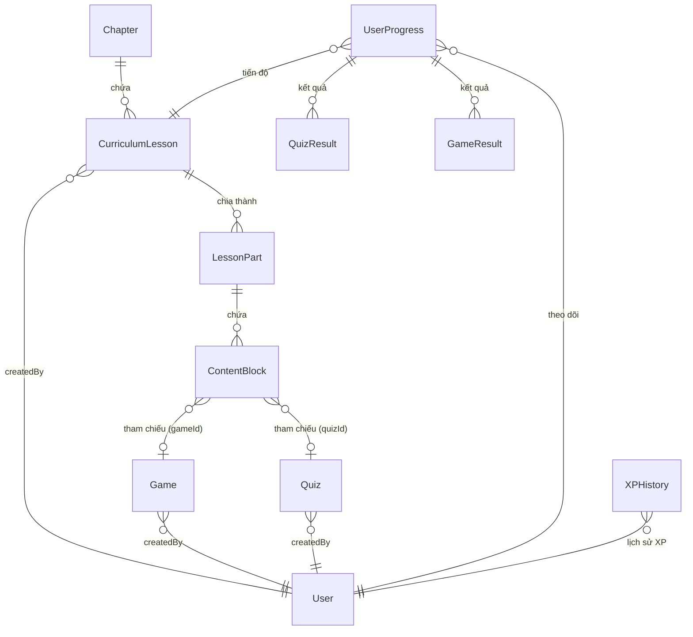
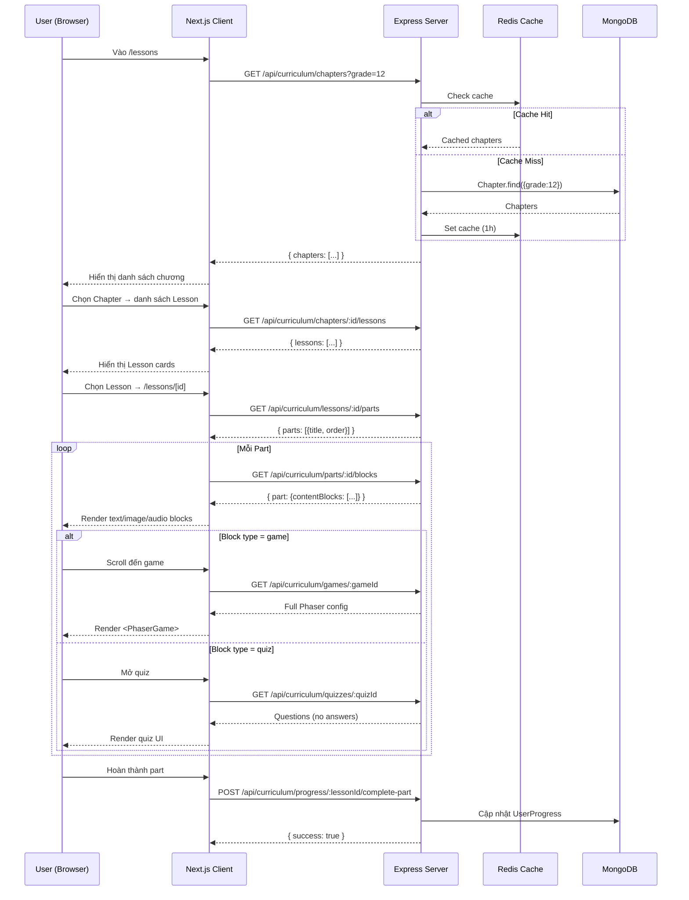

# 🏗️ SuViet360 — Kế hoạch tái kiến trúc Hệ thống Bài học (Lesson System)

> **Branch:** `feat/test` | **So sánh với:** `main`  
> **Ngày:** 04/07/2026 | **Người soạn:** Team Lead

---

## 📌 Mục lục

1. [Tổng quan](#1-tổng-quan)
2. [Kiến trúc dữ liệu mới](#2-kiến-trúc-dữ-liệu-mới)
3. [Chi tiết từng Model](#3-chi-tiết-từng-model)
4. [Hệ thống Block Builder](#4-hệ-thống-block-builder)
5. [Lazy-Load Architecture](#5-lazy-load-architecture)
6. [API Endpoints](#6-api-endpoints)
7. [Progress & Gamification](#7-progress--gamification)
8. [Staff/Admin Management](#8-staffadmin-management)
9. [Luồng dữ liệu Client](#9-luồng-dữ-liệu-client)
10. [Những gì đã thay đổi so với code cũ](#10-những-gì-đã-thay-đổi-so-với-code-cũ)
11. [Công việc cần làm tiếp](#11-công-việc-cần-làm-tiếp)

---

## 1. Tổng quan

Hệ thống bài học **phiên bản cũ** có cấu trúc phẳng:
- `Lesson` chứa tất cả: content + game + quiz trong cùng một document
- Không có Chapter, không có LessonPart
- Staff quản lý thủ công, không có builder trực quan

**Phiên bản mới** chuyển sang kiến trúc phân tầng 4 lớp, tách biệt dữ liệu nặng/nhẹ, hỗ trợ lazy-load để tối ưu hiệu năng:

```
┌─────────────────────────────────────────────────────┐
│                   CHAPTER (Chương)                    │
│  Metadata: title, grade (10/11/12), order, coverImg │
│  Virtual: lessonCount                                │
├─────────────────────────────────────────────────────┤
│               CURRICULUM LESSON (Bài học)            │
│  Metadata: title, difficulty, tags, duration, status │
│  Status flow: Draft → Pending_Review → Published     │
│  Virtual: partCount                                  │
├─────────────────────────────────────────────────────┤
│                 LESSON PART (Phần học)               │
│  Metadata: title, learningObjective, estimatedMin    │
│  Core: contentBlocks[] ←─── ĐÂY LÀ NỘI DUNG THỰC SỰ │
├─────────────────────────────────────────────────────┤
│  CONTENT BLOCKS (11 loại block)                      │
│  ┌───────┬────────┬───────┬──────────┬──────────┐  │
│  │ text  │ image  │ audio │ podcast  │  video   │  │
│  ├───────┼────────┼───────┼──────────┼──────────┤  │
│  │ game* │ quiz*  │timeline│  quote   │   map    │  │
│  ├───────┴────────┴───────┴──────────┴──────────┤  │
│  │               document                        │  │
│  └───────────────────────────────────────────────┘  │
│  * game/quiz: reference đến collection riêng         │
├─────────────────────────────────────────────────────┤
│  GAME (Collection riêng)          QUIZ (Collection riêng) │
│  - 6 game types                   - Time limit, passScore │
│  - Full Phaser config             - Shuffle, explanation  │
│  - Reusable                       - Reusable              │
└─────────────────────────────────────────────────────┘
```

---

## 2. Kiến trúc dữ liệu mới

### 2.1 So sánh Before / After

| Khía cạnh | ❌ Code cũ (main) | ✅ Code mới (feat/test) |
|-----------|------------------|------------------------|
| Phân cấp | Lesson phẳng, không Chapter | Chapter → Lesson → Part → Block (4 lớp) |
| Game | Nhúng trong Lesson schema | **Tách riêng** collection `games` |
| Quiz | Nhúng trong Lesson schema | **Tách riêng** collection `quizzes` |
| Nội dung | 1 field `content` string | Nhiều `contentBlocks` với 11 loại block |
| Builder | Không có | **Lesson Builder** kéo-thả trực quan |
| Review flow | Không có | Draft → Pending_Review → Published/Rejected |
| Cache | Không | Redis cache từng layer |
| Lazy-load | Load tất cả 1 lần | Load từng phần khi cần |
| Reuse | Không | Game & Quiz có thể dùng cho nhiều bài |

### 2.2 Sơ đồ quan hệ



---

## 3. Chi tiết từng Model

### 3.1 Chapter (`chapters`)

```typescript
{
  title: string;              // Tên chương, max 300 ký tự
  description: string;        // Mô tả, max 2000
  grade: 10 | 11 | 12;        // Khối lớp
  order: number;              // Thứ tự hiển thị
  coverImage: string;         // Ảnh bìa
  status: "Draft" | "Published";
  createdBy: ObjectId;        // ref: User
  // Virtual: lessonCount     // tự động đếm từ CurriculumLesson
}
```

**Index:** `{ grade: 1, order: 1 }`, `{ title: "text", description: "text" }`

### 3.2 CurriculumLesson (`curriculumlessons`)

> ⚠️ Collection name: `curriculumlessons` — để tránh xung đột với `Lesson` cũ

```typescript
{
  title: string;              // Tên bài, max 300
  chapterId: ObjectId;        // ref: Chapter
  order: number;              // Thứ tự trong chương
  duration: number;           // Thời lượng ước tính (phút), default 15
  difficulty: "Easy" | "Medium" | "Hard";
  tags: string[];             // Ví dụ: ["lich-su", "thoi-ky-hung-vuong"]
  thumbnail: string;
  status: "Draft" | "Pending_Review" | "Published" | "Rejected";
  reviewFeedback: string;     // Phản hồi khi Rejected
  createdBy: ObjectId;
  // Virtual: partCount       // tự động đếm từ LessonPart
}
```

**Review Flow:**
```
Draft ──(submit)──▶ Pending_Review ──(approve)──▶ Published
                         │                           
                         └──(reject)──▶ Rejected (kèm reviewFeedback)
```

### 3.3 LessonPart (`lessonparts`)

```typescript
{
  title: string;                     // Tiêu đề phần
  lessonId: ObjectId;                // ref: CurriculumLesson
  order: number;                     // Thứ tự trong bài
  learningObjective: string;         // Mục tiêu học tập
  estimatedMinutes: number;          // Thời gian ước tính (default 5)
  contentBlocks: ContentBlock[];     // ← CỐT LÕI: mảng các block nội dung
  status: "Draft" | "Published";
}
```

### 3.4 ContentBlock (Schema nhúng trong LessonPart)

```typescript
{
  type: "text" | "image" | "audio" | "video" | "timeline" 
      | "quote" | "map" | "document" | "game" | "quiz";
  data: Record<string, any>;   // Khác nhau theo type
  order: number;               // Thứ tự hiển thị
}
```

**Quy tắc `data` theo block type:**

| Type | data chứa | Nặng/Nhẹ |
|------|-----------|-----------|
| `text` | `{ text: string }` | Nhẹ |
| `image` | `{ imageUrl, caption, publicId }` | Nhẹ |
| `audio` | `{ audioUrl, title, publicId }` | Nhẹ |
| `video` | `{ url, title }` | Nhẹ |
| `timeline` | `{ events: [{ date, title, description }] }` | Nhẹ |
| `quote` | `{ text, author }` | Nhẹ |
| `map` | `{ embedUrl, title }` | Nhẹ |
| `document` | `{ title, url, description }` | Nhẹ |
| **`game`** | `{ gameId, label }` — **CHỈ reference** | **Nặng → lazy-load** |
| **`quiz`** | `{ quizId, label }` — **CHỈ reference** | **Nặng → lazy-load** |

### 3.5 Game (`games`) — TÁCH RIÊNG

```typescript
{
  title: string;
  description: string;
  gameType: "quiz_map" | "puzzle" | "drag_drop" | "rpg" | "memory" | "timeline_sort";
  thumbnail: string;
  config: {
    tilemapJsonUrl: string;
    tilemapJsonPublicId: string;
    tilesets: [{ name, imageUrl, publicId }];
    character: {
      animations: [{
        name: "idle"|"run"|"attack"|"jump"|"hurt"|"dead";
        frames: [{ key, frame, imageUrl, publicId }];
      }];
    };
    spawnPoint: { x, y };
    extra: Record<string, any>;  // Mở rộng cho game type khác
  };
  status: "Draft" | "Published";
  lessonId: ObjectId;           // Liên kết ngược về lesson
  createdBy: ObjectId;
}
```

**Lợi ích khi tách riêng:**
- ✅ Lazy-load: chỉ tải khi user scroll đến game
- ✅ Reuse: 1 game dùng cho nhiều LessonPart
- ✅ Cache riêng (Redis key riêng, CDN cho assets)
- ✅ Dễ mở rộng game type mới (qua field `extra`)

### 3.6 Quiz (`quizzes`) — TÁCH RIÊNG

```typescript
{
  title: string;
  description: string;
  timeLimit: number | null;       // Giây, null = không giới hạn
  passScore: number;              // Phần trăm, default 60
  shuffleQuestions: boolean;
  shuffleOptions: boolean;        // Default true
  questions: [{
    question: string;             // Max 1000 ký tự
    options: string[];            // 2-6 options
    correctIndex: number;
    explanation: string;          // Giải thích đáp án
    image: string;                // Ảnh kèm câu hỏi (optional)
    points: number;               // Default 1
  }];
  status: "Draft" | "Published";
  createdBy: ObjectId;
  // Virtual: totalPoints         // Tổng điểm tối đa
  // Virtual: questionCount       // Số câu hỏi
}
```

> ⚠️ **Bảo mật:** API trả quiz cho student **KHÔNG bao gồm `correctIndex`**. Admin/teacher mới thấy đầy đủ.

---

## 4. Hệ thống Block Builder

### 4.1 Tổng quan

Builder được xây dựng dưới dạng **drag-and-drop WYSIWYG**, cho phép staff tạo nội dung bài học bằng cách thêm, sắp xếp, chỉnh sửa các block.

**Vị trí code:** `client/components/lesson-builder/`

### 4.2 Các component

| Component | File | Vai trò |
|-----------|------|---------|
| **BuilderCanvas** | `BuilderCanvas.tsx` | Canvas chính — kéo thả sắp xếp block, preview, xóa |
| **BuilderSidebar** | `BuilderSidebar.tsx` | Panel chọn loại block để thêm vào canvas |
| **BlockEditor** | `BlockEditor.tsx` | Form chỉnh sửa nội dung từng block (text, image upload, chọn game/quiz...) |
| **BlockPreview** | `BlockPreview.tsx` | Xem trước block đã render (text, ảnh, timeline...) |
| **LessonContent** | `LessonContent.tsx` | Render toàn bộ nội dung bài học cho student (lazy-load game/quiz) |
| **types.ts** | `types.ts` | Shared types, `BLOCK_TYPES` registry, `emptyBlock()` factory |

### 4.3 Block Type Registry

Mỗi block type có: `type`, `label` (tiếng Việt), `description`, `color` (mã màu hiển thị).

| Type | Label | Màu | Mô tả |
|------|-------|-----|-------|
| `text` | Văn bản | `#6366f1` | Nội dung giảng bài |
| `image` | Hình ảnh | `#ec4899` | Ảnh minh họa + chú thích |
| `podcast` | Podcast | `#8b5cf6` | Chọn podcast có sẵn |
| `audio` | Âm thanh | `#10b981` | Upload file MP3 |
| `video` | Video | `#ef4444` | Link YouTube / Vimeo |
| `game` | Trò chơi | `#f59e0b` | Game Phaser tương tác → lazy-load |
| `quiz` | Câu đố | `#3b82f6` | Bộ câu hỏi trắc nghiệm → lazy-load |
| `timeline` | Dòng thời gian | `#06b6d4` | Sự kiện theo mốc thời gian |
| `quote` | Trích dẫn | `#f97316` | Lời trích dẫn nổi bật |
| `map` | Bản đồ | `#14b8a6` | Bản đồ tương tác (embed) |
| `document` | Tài liệu | `#64748b` | Link PDF / tài liệu tham khảo |

### 4.4 Upload file trong Builder

Builder hỗ trợ upload trực tiếp:
- **Hình ảnh:** Upload qua Cloudinary → lưu `imageUrl` + `publicId`
- **Âm thanh:** Upload qua Cloudinary → lưu `audioUrl` + `publicId`
- File được gửi dưới dạng `FormData` (multipart), field `images` và `audios`

---

## 5. Lazy-Load Architecture

### 5.1 Nguyên tắc

Thay vì load toàn bộ nội dung bài học một lúc, hệ thống **tải dần từng phần**:

```
┌──────────────────────────────────────────────────────────┐
│ BƯỚC 1: Load danh sách Chapter                           │
│ GET /api/curriculum/chapters?grade=12                     │
│ → Response: ~2KB (chỉ metadata)                          │
│ → Cache: Redis 1 giờ                                     │
├──────────────────────────────────────────────────────────┤
│ BƯỚC 2: Load danh sách Lesson trong Chapter              │
│ GET /api/curriculum/chapters/:id/lessons                  │
│ → Response: ~5KB (title, difficulty, tags, thumbnail)    │
│ → Cache: Redis 1 giờ                                     │
├──────────────────────────────────────────────────────────┤
│ BƯỚC 3: Load danh sách Part trong Lesson                 │
│ GET /api/curriculum/lessons/:id/parts                     │
│ → Response: ~3KB (title, order, objective) - CHƯA có nội dung │
│ → Cache: Redis 1 giờ                                     │
├──────────────────────────────────────────────────────────┤
│ BƯỚC 4: Load nội dung Part (contentBlocks)               │
│ GET /api/curriculum/parts/:id/blocks                      │
│ → Response: text, image, audio inline + gameId/quizId ref│
│ → Cache: Redis 30 phút                                   │
├──────────────────────────────────────────────────────────┤
│ BƯỚC 5: Load Game config (CHỈ khi user scroll đến game)  │
│ GET /api/curriculum/games/:id                             │
│ → Response: TOÀN BỘ Phaser config (nặng, ~50KB+)        │
│ → Cache: Redis 30 phút                                   │
├──────────────────────────────────────────────────────────┤
│ BƯỚC 6: Load Quiz questions (CHỈ khi user mở quiz)       │
│ GET /api/curriculum/quizzes/:id                           │
│ → Response: Câu hỏi + options (KHÔNG có đáp án cho student)│
│ → Cache: Redis 30 phút                                   │
└──────────────────────────────────────────────────────────┘
```

### 5.2 Cache Strategy

| Layer | Cache Key Pattern | TTL | Khi nào invalidate |
|-------|-------------------|-----|--------------------|
| Chapters | `curriculum:chapters:grade:{n}` | 1h | Staff thay đổi Chapter |
| Lessons | `curriculum:chapter:{id}:lessons` | 1h | Staff thêm/xóa Lesson |
| Parts list | `curriculum:lesson:{id}:parts` | 1h | Staff thêm/xóa Part |
| Part blocks | `curriculum:part:{id}:blocks` | 30m | Staff sửa block |
| Game | `curriculum:game:{id}` | 30m | Staff sửa game config |
| Quiz | `curriculum:quiz:{id}` | 30m | Staff sửa quiz |
| Progress | `curriculum:progress:{userId}:{lessonId}` | - | Mỗi lần update progress |

---

## 6. API Endpoints

### 6.1 Public (không cần auth)

| Method | Endpoint | Mô tả | Cache |
|--------|----------|-------|-------|
| `GET` | `/api/curriculum/chapters?grade=12` | Danh sách chương theo khối | 1h |
| `GET` | `/api/curriculum/chapters/:id` | Chi tiết chương | 1h |
| `GET` | `/api/curriculum/chapters/:id/lessons` | Danh sách bài trong chương | 1h |
| `GET` | `/api/curriculum/lessons/:id` | Chi tiết bài học | 1h |
| `GET` | `/api/curriculum/lessons/:id/parts` | Danh sách part (không có blocks) | 1h |
| `GET` | `/api/curriculum/parts/:id/blocks` | ContentBlocks của part | 30m |
| `GET` | `/api/curriculum/games` | Danh sách game (metadata) | - |
| `GET` | `/api/curriculum/games/:id` | Full config game (lazy-load) | 30m |
| `GET` | `/api/curriculum/quizzes/:id` | Câu hỏi quiz (student: k có đáp án) | 30m |
| `GET` | `/api/lessons` | Danh sách Lesson cũ (backward compat) | - |
| `GET` | `/api/lessons/:id` | Chi tiết Lesson cũ | - |
| `GET` | `/api/lessons/:id/parts` | LessonPart theo lessonId | Redis |

### 6.2 Authenticated (cần login)

| Method | Endpoint | Mô tả |
|--------|----------|-------|
| `GET` | `/api/curriculum/progress/:lessonId` | Lấy tiến độ bài học |
| `PUT` | `/api/curriculum/progress/:lessonId` | Cập nhật lastPosition, totalTimeSpent |
| `POST` | `/api/curriculum/progress/:lessonId/complete-part` | Đánh dấu hoàn thành part |
| `POST` | `/api/curriculum/progress/:lessonId/quiz-result` | Nộp kết quả quiz |
| `POST` | `/api/curriculum/progress/:lessonId/game-result` | Nộp kết quả game |

### 6.3 Admin/Staff (cần role admin hoặc staff)

| Method | Endpoint | Mô tả |
|--------|----------|-------|
| `POST` | `/api/curriculum/chapters` | Tạo Chapter mới |
| `PUT` | `/api/curriculum/chapters/:id` | Sửa Chapter |
| `DELETE` | `/api/curriculum/chapters/:id` | Xóa Chapter (cascade: lessons + games) |
| `POST` | `/api/lessons/chapters` | Tạo Chapter (alternative route) |
| `PUT` | `/api/lessons/chapters/:id` | Sửa Chapter (alternative) |
| `DELETE` | `/api/lessons/chapters/:id` | Xóa Chapter + cascade |
| `POST` | `/api/lessons/:id/parts` | Tạo LessonPart + upload files |
| `PUT` | `/api/lessons/parts/:id` | Sửa LessonPart + upload files |
| `POST` | `/api/lessons` | Tạo Lesson (cũ) |
| `PUT` | `/api/lessons/:id` | Sửa Lesson (cũ) |
| `DELETE` | `/api/lessons/:id` | Xóa Lesson (cũ) |

### 6.4 Teacher

| Method | Endpoint | Mô tả |
|--------|----------|-------|
| `PUT` | `/api/lessons/:id/approve` | Duyệt bài (Pending_Review → Published) |
| `PUT` | `/api/lessons/:id/reject` | Từ chối bài (Pending_Review → Rejected) |

---

## 7. Progress & Gamification

### 7.1 Models mới

| Model | Collection | Vai trò |
|-------|-----------|---------|
| `UserProgress` | `userprogresses` | Theo dõi tiến độ: completedParts, quizResults, gameResults, lastPosition, totalTimeSpent |
| `XPHistory` | `xphistories` | Lịch sử XP: amount, source (Lesson/Podcast/Quiz), description |

### 7.2 Công thức Level

```
Level = floor(√(XP / 100)) + 1
```

| XP | Level |
|----|-------|
| 0 | 1 |
| 100 | 2 |
| 400 | 3 |
| 900 | 4 |
| 1600 | 5 |
| 2500 | 6 |

### 7.3 XP Rewards

| Hành động | XP |
|-----------|-----|
| Hoàn thành Lesson | +100 |
| Hoàn thành Podcast | +50 |
| Quiz đậu (≥ passScore%) | +150 |
| Quiz rớt | +50 |

### 7.4 Real-time Leaderboard

- Sử dụng **Redis Pub/Sub** để broadcast XP updates
- Channel: `leaderboard:update`
- Payload: `{ userId, name, xp, level, gained, reason }`
- Socket.IO lắng nghe và push real-time cho client

### 7.5 Legacy Progress (backward compat)

`UserProgress` vẫn giữ các field cũ để tương thích ngược:
- `completedLessons[]` — danh sách Lesson cũ đã hoàn thành
- `completedPodcasts[]` — danh sách Podcast đã hoàn thành
- `quizPerformances[]` — kết quả quiz cũ
- `unlockedLessons[]` — bài đã mở khóa (sequential unlock)

---

## 8. Staff/Admin Management

### 8.1 Staff Page Tabs

Trang `client/app/staff/page.tsx` được tổ chức thành các tab:

| Tab | Component | Chức năng |
|-----|-----------|-----------|
| 📚 **Chương** | `ChaptersTab.tsx` | CRUD Chapter, lọc theo grade, sắp xếp order |
| 📖 **Bài học** | `LessonsTab.tsx` | CRUD Lesson, link đến Builder, chọn Chapter |
| 🧩 **Phần bài** | `LessonPartsEditor.tsx` | Quản lý LessonPart, thêm/sửa/xóa Part |
| 🎮 **Game** | *(trong staff page)* | CRUD Game, upload tilemap + tilesets + sprites |
| 🎙️ **Podcast** | `PodcastsTab.tsx` | CRUD Podcast, upload thumbnail + audio |
| 📝 **Blog** | `BlogTab.tsx` | Quản lý bài blog |

### 8.2 Lesson Builder Access

Staff có thể truy cập Builder qua 2 đường:
1. Từ Staff page → Tab "Bài học" → Nút **Builder**
2. Direct URL: `/staff/lesson-builder`

### 8.3 Shared Helpers

`client/components/staff/helpers.tsx` cung cấp:
- `Card` — Container component
- `SectionHeader` — Header với action button
- `statusBadge()` — Badge trạng thái (màu khác nhau)
- `FieldRow`, `inputClass`, `selectClass` — Form controls

---

## 9. Luồng dữ liệu Client

### 9.1 Web (Next.js)

```
User vào /lessons
  → Gọi curriculumApi.getChaptersByGrade(grade)
  → Hiển thị danh sách Chapter

User chọn Chapter → danh sách Lesson
  → Gọi curriculumApi.getLessonsByChapter(chapterId)
  → Hiển thị Lesson cards (difficulty, tags, duration)

User chọn Lesson → /lessons/[id]
  → Tab "Nội dung": <LessonContent lessonId={id} />
    → Gọi GET /api/curriculum/lessons/:id/parts → danh sách Part
    → Gọi GET /api/curriculum/parts/:id/blocks → contentBlocks
    → Render từng block qua BlockPreview
    → Khi scroll đến game/quiz → lazy-load GET /games/:id hoặc /quizzes/:id
  → Tab "Trò chơi": <PhaserGame /> với lesson.game config

User hoàn thành part:
  → POST /api/curriculum/progress/:lessonId/complete-part { partId }
  
User nộp quiz:
  → POST /api/curriculum/progress/:lessonId/quiz-result { quizId, answers }
```

### 9.2 Mobile (React Native/Expo)

```
User vào tab Lessons
  → Gọi lessonApi.getAll() → danh sách Lesson

User chọn Lesson → lesson/[id]
  → Hiển thị title, content, game info
  → Game Phaser note: "Chỉ khả dụng trên web"

→ Mobile hiện tại vẫn dùng API Lesson cũ
→ CẦN CẬP NHẬT: migrate sang curriculum API để có Chapter + Part + Block
```

---

## 10. Những gì đã thay đổi so với code cũ

### 10.1 Model — Tách & Thêm mới

| # | Model | Trạng thái | Ghi chú |
|---|-------|-----------|---------|
| 1 | `Chapter` | 🆕 Mới | Chương học, phân theo grade |
| 2 | `CurriculumLesson` | 🆕 Mới | Bài học metadata (collection `curriculumlessons`) |
| 3 | `LessonPart` | 🆕 Mới | Phần bài học, chứa contentBlocks |
| 4 | `Game` | 🔀 Tách ra | Trước đây nhúng trong Lesson |
| 5 | `Quiz` | 🔀 Tách ra | Trước đây nhúng trong Lesson |
| 6 | `UserProgress` | 🆕 Mới | Tiến độ curriculum flow |
| 7 | `XPHistory` | 🆕 Mới | Lịch sử điểm kinh nghiệm |
| 8 | `Lesson` (cũ) | 🔄 Giữ lại | Backward compatibility |

### 10.2 Server — Thêm mới

| File | Trạng thái |
|------|-----------|
| `server/src/controllers/curriculumController.js` | 🆕 234 dòng |
| `server/src/services/curriculumService.js` | 🆕 474 dòng |
| `server/src/routes/curriculumRoutes.js` | 🆕 87 dòng |
| `server/src/controllers/progressController.js` | 🆕 403 dòng |
| `server/src/routes/progressRoutes.js` | 🆕 24 dòng |
| `server/src/routes/lessonRoutes.js` | 🔄 Mở rộng (từ ~50 → 217 dòng) |
| `server/src/middleware/csrf.js` | 🆕 Mới |

### 10.3 Client — Thêm mới

| File/Thư mục | Trạng thái |
|-------------|-----------|
| `client/components/lesson-builder/` (6 files) | 🆕 782 dòng |
| `client/components/staff-tabs/` (5 files) | 🆕 582 dòng |
| `client/components/staff/helpers.tsx` | 🆕 119 dòng |
| `client/components/staff/types.ts` | 🆕 74 dòng |
| `client/components/teacher/TeacherModals.tsx` | 🆕 120 dòng |
| `client/lib/curriculumApi.ts` | 🆕 258 dòng |
| `client/lib/teacherReviewApi.ts` | 🆕 33 dòng |
| `client/app/lessons/[id]/page.tsx` | 🆕 133 dòng |
| `client/app/leaderboard/page.tsx` | 🔄 Mở rộng |
| `client/app/staff/lesson-builder/page.tsx` | 🆕 148 dòng |
| `client/app/staff/page.tsx` | 🔄 Mở rộng (1736 dòng) |

### 10.4 Route đổi tên

| Cũ | Mới |
|----|-----|
| `client/app/podcasts/` | `client/app/audio/` |

### 10.5 Tính năng đã xóa

- Socket-server microservice — tích hợp socket trực tiếp vào server chính
- Game config nhúng trong Lesson — chuyển sang collection `games` riêng

---

## 11. Công việc cần làm tiếp

### 🔴 Priority: Cao

- [ ] **Mobile: migrate sang curriculum API** — Mobile hiện vẫn dùng API Lesson cũ, cần cập nhật sang flow Chapter → Lesson → Part → Block
- [ ] **Game: hoàn thiện CRUD trong staff page** — Upload tilemap, tilesets, sprite animations (hiện có form nhưng cần test end-to-end)
- [ ] **Quiz: UI tạo quiz trong builder** — Hiện block quiz chỉ reference đến quiz có sẵn, cần màn hình tạo quiz
- [ ] **LessonPart: delete endpoint** — Hiện đã có POST/PUT, cần thêm DELETE
- [ ] **Test: viết thêm unit test** — Hiện mới có `progress.test.js`, cần test cho curriculum, lessonPart

### 🟡 Priority: Trung bình

- [ ] **Reorder Chapter/Lesson/Part** — API drag-drop reorder (hiện dùng order number, chưa có bulk reorder)
- [ ] **Progress: hiển thị % hoàn thành** — Tính % dựa trên completedParts / totalParts
- [ ] **Game: tích hợp PhaserGame với block game** — Hiện PhaserGame chỉ nhận `lesson.game`, cần hỗ trợ nhận `gameId` từ block
- [ ] **SEO: cập nhật metadata cho lesson page** — Thêm title, description dynamic
- [ ] **Analytics: track thời gian học mỗi part** — Dùng `lastPosition` và `totalTimeSpent`

### 🟢 Priority: Thấp

- [ ] **Import/Export Chapter** — Cho phép xuất/nhập toàn bộ chương dưới dạng JSON
- [ ] **Preview mode cho staff** — Xem bài học như student trước khi publish
- [ ] **Bulk publish** — Publish nhiều Chapter/Lesson cùng lúc
- [ ] **i18n** — Hỗ trợ tiếng Anh ngoài tiếng Việt

---

## 📎 Phụ lục

### A. Cấu trúc thư mục lesson-builder

```
client/components/lesson-builder/
├── BlockEditor.tsx       # Form editor cho từng block type
├── BlockPreview.tsx      # Preview render block
├── BuilderCanvas.tsx     # Canvas kéo-thả chính
├── BuilderSidebar.tsx    # Panel chọn block type
├── LessonContent.tsx     # Component render nội dung cho student
└── types.ts              # Types + Block registry
```

### B. Cấu trúc thư mục staff-tabs

```
client/components/staff-tabs/
├── BlogTab.tsx           # Quản lý blog
├── ChaptersTab.tsx       # CRUD Chapter
├── LessonPartsEditor.tsx # Quản lý LessonPart
├── LessonsTab.tsx        # CRUD Lesson + link Builder
└── PodcastsTab.tsx       # CRUD Podcast
```

### C. Biểu đồ luồng dữ liệu tổng thể



---

